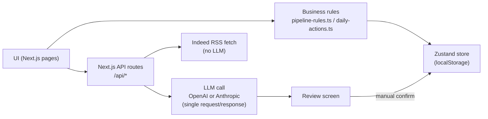

# CareerStudio

## What it is

CareerStudio is a personal job-search operations tool, built for a Strategy & Operations-style search. It treats the search as a pipeline with rules — opportunities, applications, follow-up windows, interview prep, network tracking — instead of a spreadsheet. A handful of steps (CV targeting, application-pack drafting, interview prep, LinkedIn "About" drafting) are LLM-assisted, but every status change and every save is a manual, explicit user action.

## Why I built it

A job search is an operations problem: a pipeline of opportunities, prioritization under limited time, follow-up rules that are easy to forget (day 7, day 21, day 30), deadlines, go/no-go decisions, and preparation work. CareerStudio encodes that discipline into software instead of a scattered set of notes and reminders.

## Core capabilities

Verified against the current code (`src/lib/`, `src/app/api/`):

| Area | What it does |
|---|---|
| Daily dashboard (`/`) | KPIs, prioritized actions, pipeline overview — computed by `lib/daily-actions.ts` |
| Opportunity pipeline (`/opportunites`, `/candidatures`) | Manual status confirmation only; each confirmation creates an `ApplicationEvent` with `source: "manual"` — no automatic status change |
| Follow-up rules | Day-7 / day-21 / day-30 suggestions (`lib/pipeline-rules.ts`) — always a suggestion, never an automatic action |
| CV targeting (`/cv`, opportunity detail) | LLM-assisted, tailors CV bullets/keywords/ATS flags to one job description |
| Application pack, interview prep, LinkedIn "About" | LLM-assisted drafting, reviewed before save |
| Profile Intelligence (`/profil`) | LLM-assisted analysis of the candidate profile, reviewable before it overwrites anything |
| Job scouting (`/opportunites`) | Real fetch against Indeed's RSS feed, dedup by URL — **no LLM involved**, plain data fetching |
| Data-quality guards | `lib/content-quality.ts` rejects raw CV-dump text pasted into a single field (heuristics: length, year count, legal-entity suffixes, contact info) |
| Persistence | Everything lives in the browser via `localStorage` (Zustand `persist`, key `careerstudio-store`) — no server-side database |

Also present, not LLM-related: `/reseau` (contact tracking), `/memoire` (interview notes/feedback search), `/progression` (funnel/response-rate stats), `/parametres` (JSON export, demo/real mode, reset).

## AI usage

Two providers are supported, both called with a plain `fetch` — **no SDK, no tool/function calling, no agent framework, no orchestration**:

- **OpenAI** — Responses API (`https://api.openai.com/v1/responses`), model configurable via `OPENAI_MODEL` (default `gpt-5.4-mini`), with a strict JSON schema (`text.format.type: "json_schema"`) for structured output.
- **Anthropic** — Messages API (`https://api.anthropic.com/v1/messages`), model configurable via `ANTHROPIC_MODEL` (default `claude-sonnet-4-6`); the prompt asks for JSON directly, and the response is parsed and validated in code (`src/lib/llm/cv-targeting.ts`).

The active provider is chosen by `LLM_PROVIDER` or auto-detected from whichever API key is present.

Each of the 5 LLM-assisted features (CV targeting, application pack, interview prep, LinkedIn About, profile intelligence) is **one single prompt-in / JSON-out call** — not a multi-step process, not an agent that chooses actions.

**What stays deterministic, in plain TypeScript, never touched by the LLM:** pipeline status, follow-up scheduling, opportunity/CV scoring, all persistence (`lib/pipeline-rules.ts`, `lib/daily-actions.ts`) — covered by the business-rule test suite below.

**What the AI does not do:** it never changes an application's status, never saves anything without a manual confirmation, and is explicitly instructed not to invent facts — the CV-targeting prompt states *"N'invente aucun chiffre, entreprise, titre ou diplome absent du profil"* (`src/lib/llm/cv-targeting.ts:136`). There is no memory between calls and no agent.

## Architecture



## Reliability / testing

Run 2026-09-01, on the current codebase:

- `npm run test:business` — hand-written Node test harness (`scripts/business-rules-check.cjs`): **120/120 checks passed**. Covers skill categorization, evidence matching, objection/pitch generation, completeness scoring, raw-CV-dump detection, and parsing/normalization of LLM responses (including malformed ones).
- `npx tsc --noEmit` — 0 errors.
- `npm run lint` — 0 warnings.
- `npm run build` — succeeds; 15 routes (6 API routes, 9 pages).

No end-to-end/UI test suite exists yet — noted here rather than implied.

## Tech stack

Next.js 16 (App Router, Turbopack) · React 19 · TypeScript 5 · Tailwind CSS 4 · Zustand 5 (`persist` / `localStorage`) · shadcn/ui + Lucide icons · `pdfjs-dist` (local PDF text extraction for CV import) · direct `fetch` to OpenAI and Anthropic (no SDK).

## Running locally

```bash
npm install
npm run dev
```

Open `http://localhost:3000`. The app runs fully without any API key — LLM-assisted features degrade to a clearly-labeled "unavailable" state instead of failing silently. To enable them, copy `.env.local.example` to `.env.local` and set `OPENAI_API_KEY` and/or `ANTHROPIC_API_KEY`.

## Screenshots

_Not yet included. Suggested set (4, taken from a browser with demo data loaded via `/parametres`):_
1. `/` — daily dashboard (KPIs, prioritized actions, pipeline)
2. Opportunity detail panel — CV targeting / application pack view
3. `/candidatures` — pipeline with manual confirmation UI and follow-up suggestions
4. `/profil` — Profile Intelligence view

## Status

Personal working prototype, actively used to run my own Strategy & Operations job search. Local-only: no deployed instance, no multi-user support, no server-side database. Development history and open questions are tracked in `docs/HANDOFF.md` and `docs/TASKS.md`.
